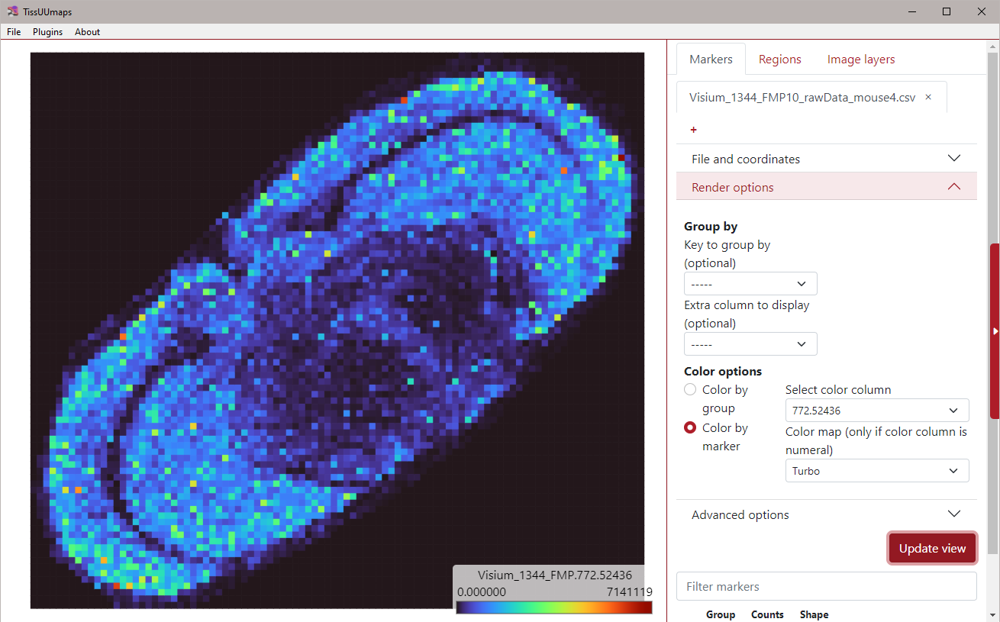

# Load and look at MALDI data in TissUUmaps
By Christophe Avenel

## Data
- Folder: `dataset_3_maldi_data/`
- Markers: `20220617_Visium_1344_FMP10_rawData_mouse4.csv`

## General
1. Inspect the `20220617_Visium_1344_FMP10_rawData_mouse4.csv` marker file in a  to understand its structure. It contains three columns: X, Y and Gene (resp. X and Y coordinates of each point on the DAPI image, and its corresponding gene name).

    
1. Load the csv marker file into TissUUmaps, either by drag and drop again, or through the Markers tab in TissUUmaps, using the `[+]` button.
1. Give a new name to the created Tab (for example: `MALDI data`) and select X and Y columns as coordinates.
1. You can already display your markers by clicking on **[Update view]**. All markers will have the same color and be in one group named “All”.
1. In **Render Options**, select `Color by marker` option, and chose one of the field in the `Select color column` dropdown.
1. Choose a color map (for example: `Turbo`) from the `Color map` dropdown
1. In **Advanced Options**, change the marker size factor to `3.3`, then select `Use a fixed shape` with the `square` option, and check `Remove outline` from the **Marker shape** section:
    
    <kbd>
        
    </kbd>
1. Click **[Update view]** again.
1. In **Render Options**, change the value in the `Select color column` dropdown to display different layers. Don't forget to press the **[Update view]** button after changing the value.

    

> **Note**  
> You can test an online version of TissUUmaps to see how a project can be shared: https://tissuumaps.scilifelab.se/private/Christophe/massspec/project.tmap